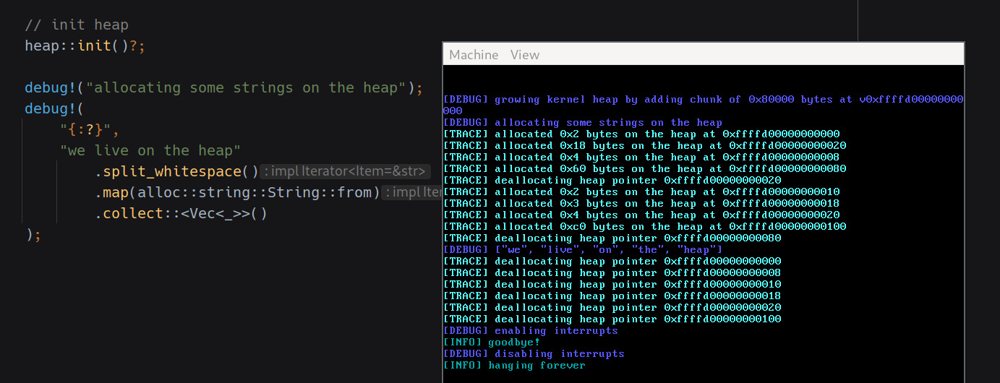
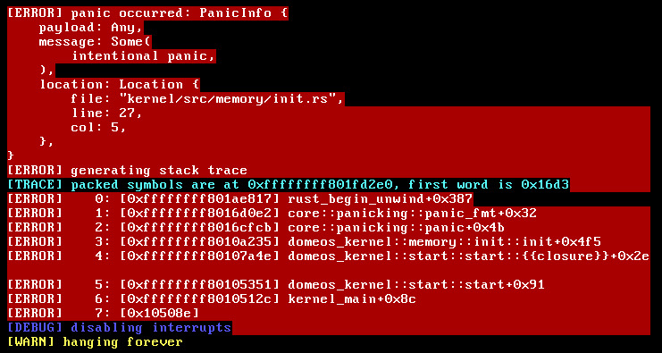
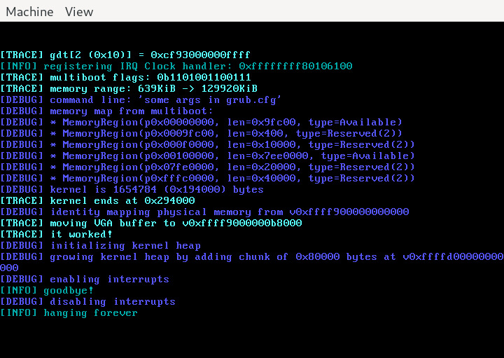

# DomeOS
A toy x86_64 OS in Rust.

## Progress log

* 20 Feb 2021: <em>A basic kernel heap</em>
<p style="margin: auto"></p>

* 20 Feb 2021: <em>Manual stack walking and resolution of symbols on panic. Involves packing the linker map into a binary format and patching it into the binary after build</em>
<p style="margin: auto"></p>

* 20 Feb 2021: <em>Startup in QEMU (it doesn't do anything yet)</em>
<p style="margin: auto"></p>

## Features

* [X] x64 long mode
* [X] Basic interrupt handling (exceptions and clock IRQ)
* [X] Logging through serial port and VGA
* [X] Properly resolved backtraces on panic
* Memory management
  * [X] Physical frame allocation
  * [X] Mapping regions of virtual memory into current address space
  * [X] Kernel heap
  * [X] Demand paging - physical pages only allocated when accessed
  * [ ] Guard pages to detect stack overflow
  * [ ] CoW pages
  * [ ] Mmaped files
* Processes
  * [ ] Manual creation and allocation of kernel process (heap, stack etc)
  * [ ] PE binary loader
  * [ ] Userspace process
  * [ ] Syscalls
  * [ ] Basic Rust `std` userspace implementation
* ...everything else...

## Building
Only tested on Linux with the Rust nightly specified in `rust-toolchain`.

Dependencies:

* mtools
* grub
* xorriso
* qemu
* ld

```
$ scons                # builds only
$ scons run            # builds and runs in qemu
$ scons run headless=1 # builds and runs in qemu with no graphical window
$ scons -c             # cleans build, might be needed before multiple consecutive `scons run` without code changes
```
