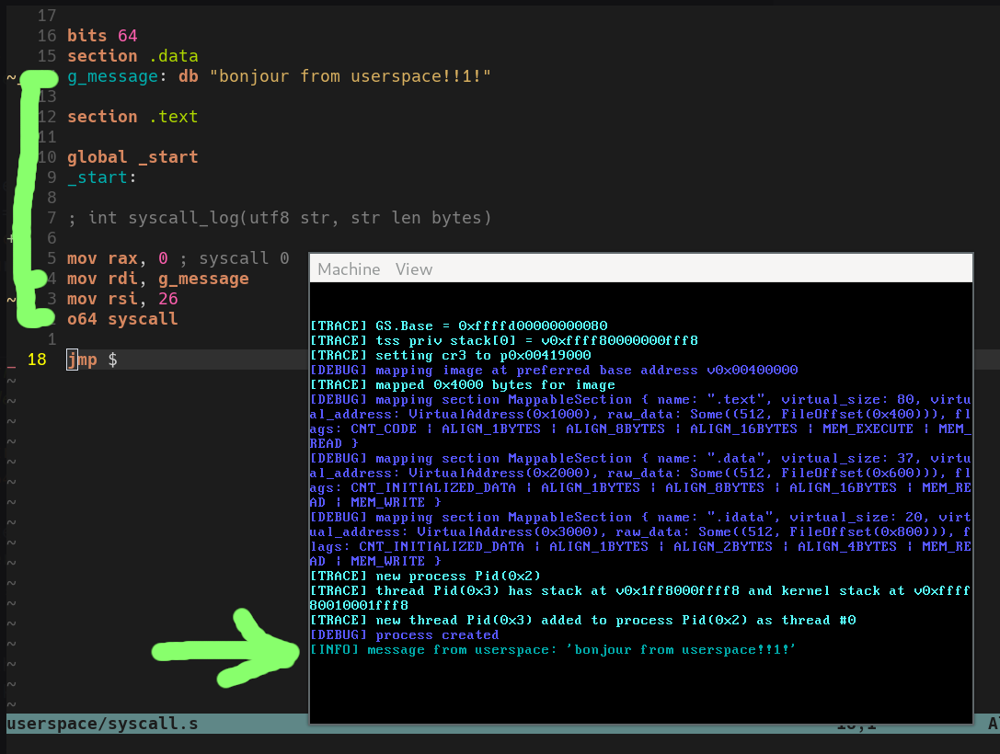

# DomeOS
A toy x86_64 OS in Rust.

## Progress log

* 08 Mar 2021: <em>A functional syscall that prints a string to VGA. [syscall.s](userspace/syscall.s) is [compiled](userspace/README.md) to a freestanding Windows PE, which is embedded in the kernel binary (no filesystem!). It is loaded and executed in usermode in its own address space.</em>
<p style="margin: auto"></p>

* 20 Feb 2021: <em>A basic kernel heap</em>
<p style="margin: auto"></p>

* 20 Feb 2021: <em>Manual stack walking and resolution of symbols on panic. Involves packing the linker map into a binary format and patching it into the binary after build</em>
<p style="margin: auto"></p>

* 20 Feb 2021: <em>Startup in QEMU (it doesn't do anything yet)</em>
<p style="margin: auto"></p>

## Features

* [X] x64 long mode
* [X] Basic interrupt handling (exceptions and clock IRQ)
* [X] Logging through serial port and VGA
* [X] Properly resolved backtraces on panic
* Memory management
  * [X] Physical frame allocation
  * [X] Mapping regions of virtual memory into current address space
  * [X] Kernel heap
  * [X] Demand paging - physical pages only allocated when accessed
  * [X] Guard pages
  * [ ] CoW pages
  * [ ] `mmap`ped files
* Processes
  * [X] Simple PE binary loader
  * [X] Process creation and execution from hardcoded .exe blob
  * [X] Userspace process
  * [X] Growable userspace stacks with guard pages
  * [ ] Userspace heap
  * [X] Basic syscall with SYSCALL/SYSRET
	* [ ] Actually useful syscalls
	* [ ] Linux/Windows syscall compatibility
  * Process lifecycle
    * [X] Creation of address space and threads
    * [X] Jump to executing thread in kernel/userspace
    * [ ] Scheduling/preemption
    * [ ] Exiting
  * [ ] Basic Rust `std` userspace implementation
* [ ] Add support for hardware without 1G pages (inc. VirtualBox and Bochs)
* Devices
  * [ ] Keyboard/mouse
  * [ ] Filesystem
  * [ ] Networking

* ...everything else...

## Building
Only tested on Linux with the Rust nightly specified in `rust-toolchain`.

Dependencies:

* mtools
* grub
* xorriso
* qemu
* ld

```
$ scons                # builds only
$ scons run            # builds and runs in qemu
$ scons run headless=1 # builds and runs in qemu with no graphical window
$ scons -c             # cleans build, might be needed before multiple consecutive `scons run` without code changes
```
